# Quote-to-Cash Lifecycle

## Overview
The Quote-to-Cash (Q2C) lifecycle represents the complete sales process from initial customer inquiry through payment collection. This document maps the current implementation status and planned enhancements.

## Lifecycle Stages

```mermaid
graph LR
    A[RFQ Received] --> B[Quote Created]
    B --> C[Quote Sent]
    C --> D[Quote Accepted]
    D --> E[Order Created]
    E --> F[Order Fulfilled]
    F --> G[Invoice Generated]
    G --> H[Payment Received]
    H --> I[Cash Applied]
    
    style A fill:#90EE90
    style B fill:#90EE90
    style C fill:#90EE90
    style D fill:#FFA500
    style E fill:#FFA500
    style F fill:#FF6B6B
    style G fill:#FF6B6B
    style H fill:#FF6B6B
    style I fill:#FF6B6B
```



**Legend:**
- 🟢 Green: Implemented
- 🟠 Orange: Partially Implemented
- 🔴 Red: Not Implemented

## Current State Analysis

### ✅ Implemented Features

#### 1. Quote Management (`/quote-b2b`)
- **Create Quote**: Upload RFQ, OCR extraction, line item editing
- **Quote Builder**: Product selection, pricing, discounts
- **Customer Intelligence**: Contract pricing, credit status, order history
- **Quote Actions**: Save draft, send to customer, clone, export
- **Status Tracking**: Draft → Sent → Accepted/Rejected

#### 2. Order Management (`/orders-b2b`)
- **Order List**: View all orders with filtering
- **Order Details**: Line items, customer info, status
- **Order Sources**: Email, EDI, API tracking
- **Status Updates**: Processing → Shipped → Delivered

### ⚠️ Partially Implemented

#### 3. Quote-to-Order Conversion
- **Current**: Manual process, no direct UI connection
- **Gap**: No conversion workflow or PO capture

### ❌ Not Implemented

#### 4. Fulfillment Management
- Shipment tracking
- Partial shipments
- Backorder management
- Carrier integration
- Delivery confirmation

#### 5. Invoice Management
- Invoice generation from orders
- Invoice preview and editing
- Email invoice delivery
- Credit memo creation
- Invoice aging reports

#### 6. Payment Processing
- Payment recording
- Multiple payment methods
- Partial payments
- Payment application
- Cash reconciliation

#### 7. Accounts Receivable
- AR aging reports
- Collection workflows
- Credit limit management
- DSO tracking
- Customer statements

## Proposed Implementation

### Phase 1: Quote-to-Order Bridge
**Timeline**: Immediate

1. **Convert to Order Modal**
   - Triggered after quote acceptance
   - Captures PO number (required)
   - Delivery date selection
   - Payment terms confirmation
   - Creates order with reference to quote

### Phase 2: Invoice Generation
**Timeline**: Week 1-2

1. **Invoice Module** (`/invoices`)
   - List view with status filters
   - Invoice detail page
   - PDF generation
   - Email delivery

2. **Invoice Creation**
   - Generate from fulfilled orders
   - Line item editing
   - Tax calculation
   - Terms and conditions

### Phase 3: Payment Recording
**Timeline**: Week 2-3

1. **Payment Module** (`/payments`)
   - Payment entry form
   - Payment methods (Check, ACH, Wire, CC)
   - Partial payment support
   - Payment history

2. **Payment Application**
   - Apply to specific invoices
   - Handle overpayments/underpayments
   - Generate receipts

### Phase 4: AR Dashboard
**Timeline**: Week 3-4

1. **AR Analytics**
   - Aging buckets (Current, 30, 60, 90+)
   - Customer credit status
   - Collection priorities
   - Cash flow forecasting

## User Flows

### Flow 1: Quote to Order
```
1. Sales rep creates quote
2. Customer receives quote via email
3. Customer accepts quote
4. System prompts for PO number
5. Order created with quote reference
6. Order confirmation sent
```

### Flow 2: Order to Invoice
```
1. Order marked as shipped
2. Invoice automatically generated
3. Sales rep reviews invoice
4. Invoice sent to customer
5. Payment terms timer starts
```

### Flow 3: Invoice to Cash
```
1. Customer sends payment
2. AR clerk records payment
3. Payment applied to invoice(s)
4. Receipt sent to customer
5. GL entries created
```

## Data Model Extensions

### New Entities Needed

#### Invoice
```typescript
interface Invoice {
  id: string
  invoice_number: string
  order_id: string
  customer_id: string
  status: 'draft' | 'sent' | 'paid' | 'partial' | 'overdue'
  issue_date: Date
  due_date: Date
  line_items: InvoiceLineItem[]
  subtotal: number
  tax_amount: number
  total: number
  amount_paid: number
  balance_due: number
}
```

#### Payment
```typescript
interface Payment {
  id: string
  payment_number: string
  customer_id: string
  amount: number
  method: 'check' | 'ach' | 'wire' | 'credit_card'
  reference_number: string
  received_date: Date
  applied_to: PaymentApplication[]
  notes?: string
}
```

#### PaymentApplication
```typescript
interface PaymentApplication {
  invoice_id: string
  amount_applied: number
  applied_date: Date
}
```

## Navigation Updates

Add to main navigation:
- **Invoices** (position 5, after Orders)
- **Payments** (position 6, after Invoices)

## Success Metrics

1. **Conversion Rate**: Quote-to-Order conversion %
2. **Cycle Time**: Average days from quote to cash
3. **DSO**: Days Sales Outstanding
4. **Collection Rate**: % of invoices paid on time
5. **Process Efficiency**: Time saved per transaction

## Next Steps

1. ✅ Create this documentation
2. 🚧 Implement Quote-to-Order conversion modal
3. ⏳ Build Invoice management page
4. ⏳ Build Payment recording page
5. ⏳ Create AR dashboard
6. ⏳ Integrate with ERP for GL posting